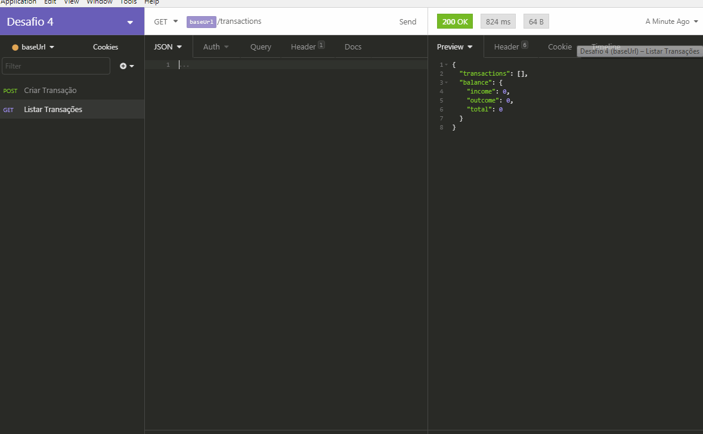
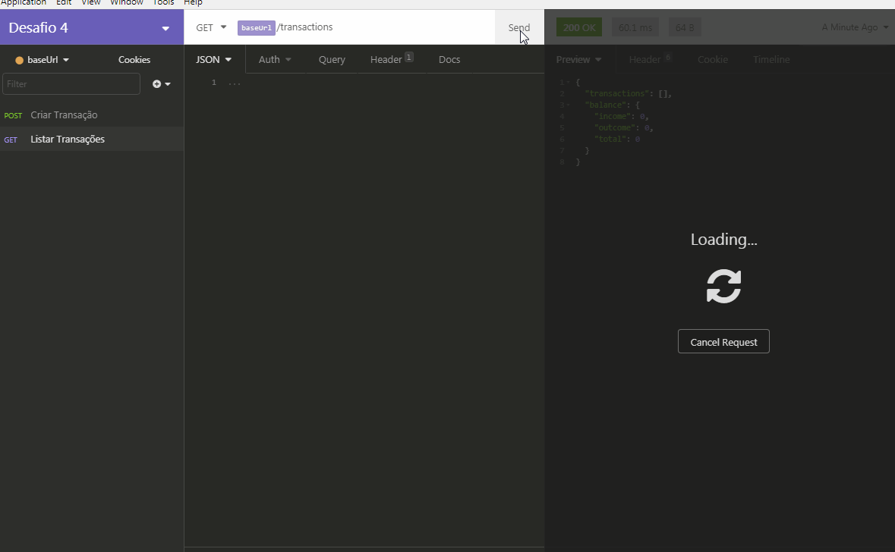

<h3 align="center">
  Desafio 04: Fundamentos do NodeJS - Introduzindo conceitos SOLID
</h3>

<blockquote align="center">“JUST START."</blockquote>

<p align="center">
  

  

  

</p>

<p align="center">
  <a href="#rocket-sobre-o-desafio">Sobre o desafio</a>&nbsp;&nbsp;&nbsp;|&nbsp;&nbsp;&nbsp;
  <a href="#meu-resultado">Meu Resultado</a>&nbsp;&nbsp;&nbsp;
</p>

## :rocket: Sobre o desafio

Desenvolver uma aplicação para continuar treinando o que você aprendeu até agora no Node.js junto ao TypeScript, utilizando o conceito de models, repositories e services. Essa será uma aplicação para armazenar transações financeiras de entrada e saída, que deve permitir o cadastro e a listagem dessas transações.


### Funcionalidade da aplicação

- **`Criar registro de transações`**: Aplicação deve receber **title**, **value** e **type** dentro do corpo da requisição, sendo type o tipo da transação, que deve ser income para entradas (depósitos) e outcome para saídas (retiradas). Ao cadastrar uma nova transação, ela deve ser armazenada dentro de um objeto com o seguinte formato :

```json
{
  "id": "uuid",
  "title": "Salário",
  "value": 3000,
  "type": "income"
}
```

- **`Listar transações e balanço financeiro total`**: A aplicação deve retornar uma listagem com todas as transações que foram cadastradas, junto com o valor de soma de entradas, retiradas e total de crédito. Essa rota deve retornar um objeto com o formato a seguir:

```json
{
  "transactions": [
    {
      "id": "uuid",
      "title": "Salário",
      "value": 4000,
      "type": "income"
    },
    {
      "id": "uuid",
      "title": "Freela",
      "value": 2000,
      "type": "income"
    },
    {
      "id": "uuid",
      "title": "Pagamento da fatura",
      "value": 4000,
      "type": "outcome"
    },
    {
      "id": "uuid",
      "title": "Cadeira Gamer",
      "value": 1200,
      "type": "outcome"
    }
  ],
  "balance": {
    "income": 6000,
    "outcome": 5200,
    "total": 800
  }
}
```

### Especificação dos testes

- **`should be able to create a new transaction`**: Para que esse teste passe, a aplicação deve permitir que uma transação seja criada, e retorne um json com a transação criada.

- **`should be able to list the transactions`**: Para que esse teste passe, a aplicação deve permitir que seja retornado um objeto contendo todas as transações junto ao balanço de income, outcome e total das transações que foram criadas até o momento.

- **`should not be able to create outcome transaction without a valid balance`**: Para que esse teste passe, a aplicação não deve permitir que uma transação do tipo `outcome` extrapole o valor total que o usuário tem em caixa, retornando uma resposta com código HTTP 400 e uma mensagem de erro no seguinte formato: `{ error: string }`

### Meu Resultado

- **`Criando transações`**:





- **`Listagem e balanço total`**:





Agradeço a 💜Rocketseat :wave: [Discord!](https://discordapp.com/invite/gCRAFhc)
